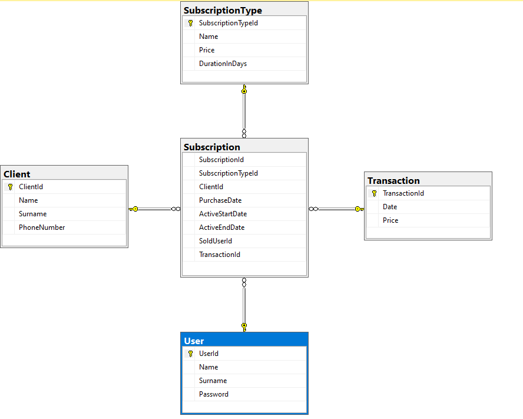
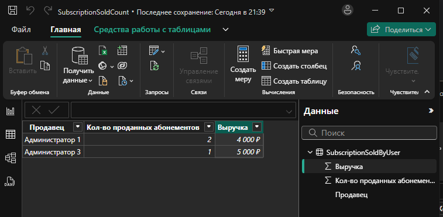
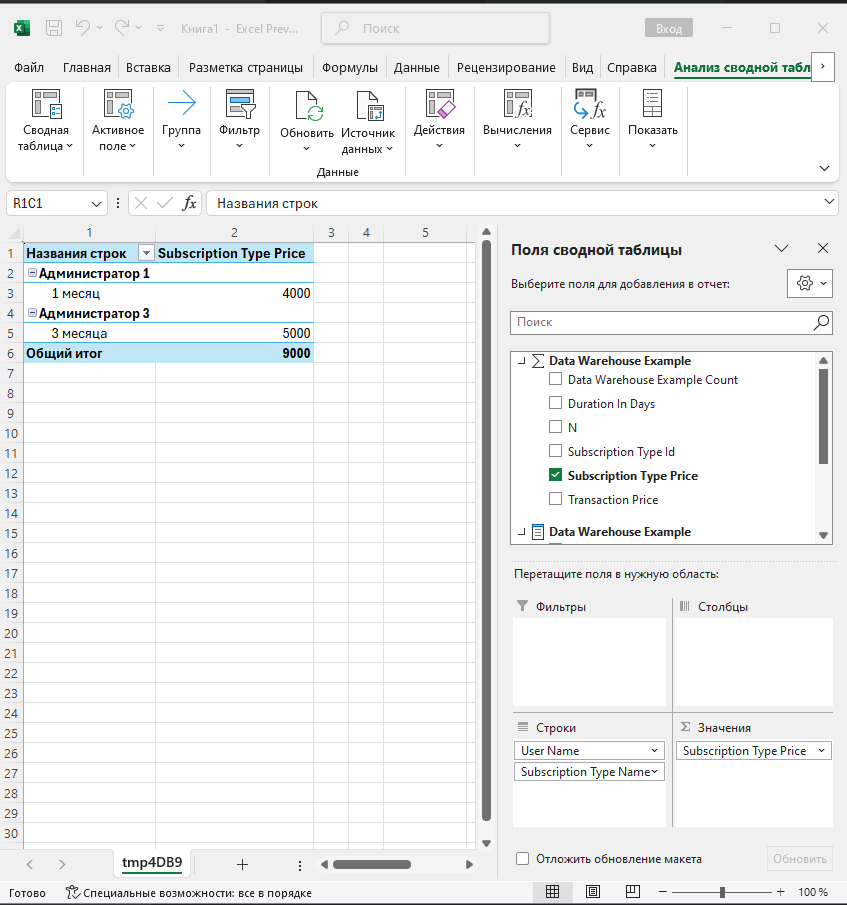

### CRM система по учету абонементов тренажерного зала.
 Фирма организует продажу абонементов в тренажерный зал. Компания определяет доступные типы абонементов, его цену и длительность. Система хранит информацию о всех проданных абонементах, сотрудниках его продавшего и выручку

Диаграмма базы данных:


Центральным звеном является абонемент, который, в свою чередь ссылается на тип купленнго абонмента (SubscriptionType), клиента купившего его(Client), платеж сделанный клиентом (Transaction) и сотрудник, продавший данный абонемент(User)


База и таблицы созданы с помощью запроса 
``` sql
create database fitness_crm
go

use fitness_crm;
go;

CREATE TABLE dbo.Client (
  ClientId int IDENTITY(1,1) PRIMARY KEY NOT NULL,
  Name nvarchar(50) NOT NULL,
  Surname nvarchar(50) NOT NULL,
  PhoneNumber nvarchar(50)
);

CREATE TABLE dbo.SubscriptionType (
  SubscriptionTypeId int IDENTITY(1,1)  PRIMARY KEY NOT NULL,
  Name nvarchar(50) NOT NULL,
  Price int NOT NULL,
  DurationInDays int NOT NULL
);
CREATE TABLE dbo.[Transaction] (
  TransactionId int IDENTITY(1,1)  PRIMARY KEY NOT NULL,
  Date datetime2 NOT NULL,
  Price money NOT NULL
);

CREATE TABLE dbo.[User] (
  UserId int IDENTITY(1,1) PRIMARY KEY NOT NULL,
  Name nvarchar(50) NOT NULL,
  Surname nvarchar(50) NOT NULL,
  Password nvarchar(20) NOT NULL
);
GO

CREATE TABLE dbo.Subscription (
  SubscriptionId int IDENTITY(1,1)  PRIMARY KEY,
  SubscriptionTypeId int NOT NULL,
  ClientId int NOT NULL,
  PurchaseDate datetime2 NOT NULL,
  ActiveStartDate datetime2 NOT NULL,
  ActiveEndDate datetime2 NOT NULL,
  SoldUserId int NOT NULL,
  TransactionId int NOT NULL,
  FOREIGN KEY (ClientId) REFERENCES Client (ClientId),
  FOREIGN KEY (SubscriptionTypeId) REFERENCES SubscriptionType (SubscriptionTypeId),
  FOREIGN KEY (SoldUserId) REFERENCES [User] (UserId),
  FOREIGN KEY (TransactionId) REFERENCES [Transaction] (TransactionId)
);
GO

```

В таблицах применяются ограничения при добавлении данных:
``` sql
Alter table dbo.Client  ADD CHECK (len(Client.PhoneNumber)=11)
Alter table dbo.SubscriptionType  ADD CHECK (Price>0)
Alter table dbo.[User]  ADD CHECK (len(trim(Password))>10)
```

Для ускорения поиска клиента по номеру телефона и подсчета количества выручки в кассе, добавлены индексы
``` sql
create unique index Client_PhoneNumber_uindex
    on Client (PhoneNumber)

create index Transaction_Date_Price_index
    on [Transaction] (Date, Price)
```


В качестве демо были добавлены следующие данные
``` sql
SET IDENTITY_INSERT dbo.Client ON;
INSERT INTO fitness_crm.dbo.Client (ClientId, Name, Surname, PhoneNumber) VALUES (2, N'Клиент 1', N' ', 11111111111);
INSERT INTO fitness_crm.dbo.Client (ClientId, Name, Surname, PhoneNumber) VALUES (3, N'Клиент 2', N' ', 22222222222);
INSERT INTO fitness_crm.dbo.Client (ClientId, Name, Surname, PhoneNumber) VALUES (4, N'Клиент 3', N' ', 33333333333);
SET IDENTITY_INSERT dbo.Client OFF;

SET IDENTITY_INSERT dbo.[User] ON;
INSERT INTO fitness_crm.dbo.[User] (UserId, Name, Surname, Password) VALUES (1, N'Администратор 1', N'', N'11111111111');
INSERT INTO fitness_crm.dbo.[User] (UserId, Name, Surname, Password) VALUES (2, N'Администратор 2', N'', N'22222222222222');
INSERT INTO fitness_crm.dbo.[User] (UserId, Name, Surname, Password) VALUES (3, N'Администратор 3', N'', N'3333333333333333');
SET IDENTITY_INSERT dbo.[User] OFF;


SET IDENTITY_INSERT dbo.SubscriptionType ON;
INSERT INTO fitness_crm.dbo.SubscriptionType (SubscriptionTypeId, Name, Price, DurationInDays) VALUES (1, N'1 месяц', 2000.0000, 30);
INSERT INTO fitness_crm.dbo.SubscriptionType (SubscriptionTypeId, Name, Price, DurationInDays) VALUES (2, N'3 месяца', 5000.0000, 150);
SET IDENTITY_INSERT dbo.SubscriptionType OFF;

SET IDENTITY_INSERT dbo.[Transaction] ON;
INSERT INTO fitness_crm.dbo.[Transaction] (TransactionId, Date, Price) VALUES (1, N'2024-11-09 20:32:57.0000000', 2000.0000);
INSERT INTO fitness_crm.dbo.[Transaction] (TransactionId, Date, Price) VALUES (2, N'2024-11-25 20:34:47.0000000', 2000.0000);
INSERT INTO fitness_crm.dbo.[Transaction] (TransactionId, Date, Price) VALUES (3, N'2024-12-01 20:36:51.0000000', 5000.0000);
SET IDENTITY_INSERT dbo.[Transaction] OFF;

SET IDENTITY_INSERT dbo.Subscription ON;
INSERT INTO fitness_crm.dbo.Subscription (SubscriptionId, SubscriptionTypeId, ClientId, PurchaseDate, ActiveStartDate, ActiveEndDate, SoldUserId, TransactionId) VALUES (3, 1, 2, N'2024-11-09 20:28:50.0000000', N'2024-11-09 20:29:08.0000000', N'2024-12-09 20:29:26.0000000', 1, 1);
INSERT INTO fitness_crm.dbo.Subscription (SubscriptionId, SubscriptionTypeId, ClientId, PurchaseDate, ActiveStartDate, ActiveEndDate, SoldUserId, TransactionId) VALUES (5, 1, 3, N'2024-11-25 20:35:08.0000000', N'2024-11-25 20:35:11.0000000', N'2024-12-25 20:35:14.0000000', 1, 2);
INSERT INTO fitness_crm.dbo.Subscription (SubscriptionId, SubscriptionTypeId, ClientId, PurchaseDate, ActiveStartDate, ActiveEndDate, SoldUserId, TransactionId) VALUES (6, 2, 4, N'2024-11-19 20:37:47.0000000', N'2024-12-01 20:37:53.0000000', N'2024-03-01 20:38:46.0000000', 2, 3);
SET IDENTITY_INSERT dbo.Subscription OFF;
```

Для построения аналитики подсчета количества проданных абонементов создано представление
``` sql
CREATE VIEW SubscriptionSoldByUser
as
SELECT u.Name, COUNT(*) SubscriptionSoldCountfrom, SUM(t.Price) as ReceivedMoney
FROM dbo.Subscription s
       INNER JOIN dbo.[User] u ON u.UserId = s.SoldUserId
       INNER JOIN dbo.[Transaction] t ON s.TransactionId = t.TransactionId
GROUP BY u.Name
```



